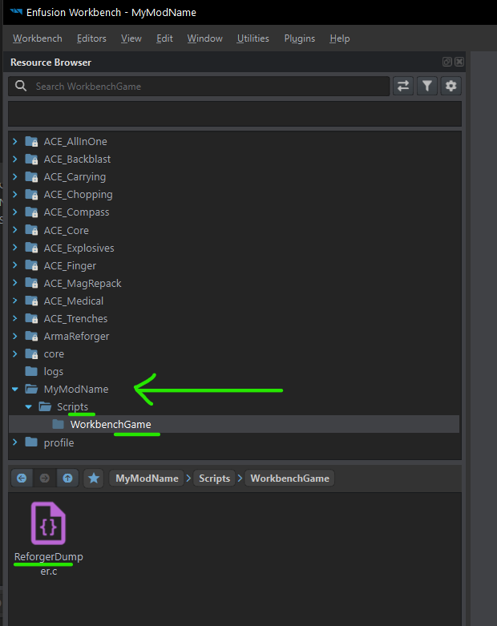
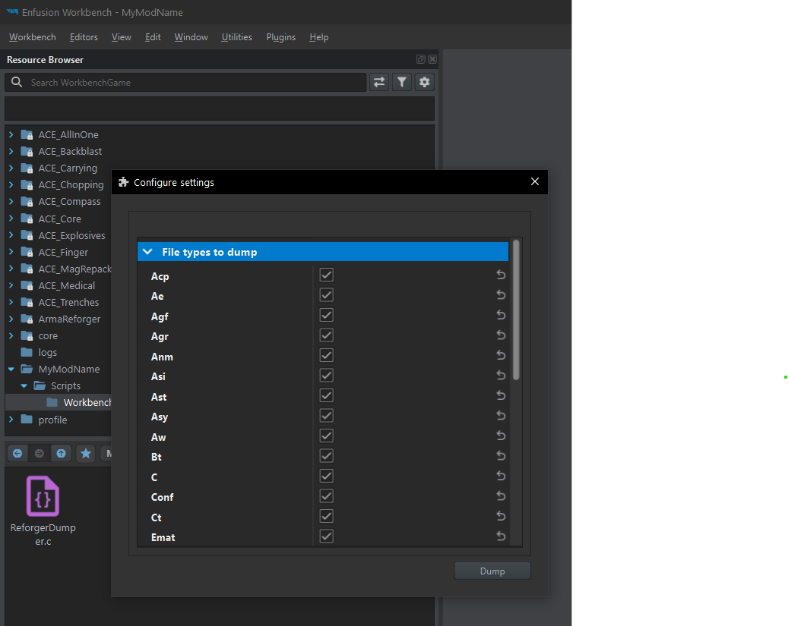

# Fork details
This is fixed resources dumper early 2025 version with instruction how to use it. 
## How to install:
- You need to put `Scripts` folder content from this repo into your mod root dir 
Example: 

- Next, you need to press `CTRL+SHIFT+R` to reload plugins 
- If everything fine and no errors been detected you can press `CTRL+D` 
- If you see dump menu - congratulations, plugin is working 
 

- Press dump, "Allow all", and wait
- You can find dumped files in ` ... \Documents\My Games\ArmaReforgerWorkbench\profile\Dump` 
 

# Original description below
All thanks and credits to `pennyworth12345` for such useful plugin!

Original description

This is an Enfusion Workbench plugin to dump all of the files from the Resource Browser to the local file system. The main use case for this is an easier method to search for things in the various configs and file formats. As far as I'm aware, the only file search that is currently possible is for script files. The dump could also be useful for diffing after a game update to get a more detailed idea of exactly what changed.

The only places files can be written to is `$save` and `$profile`, and this plugin writes to the `$profile`. The default location `$profile` location for me on Windows 11 is `C:\Users\Username\Documents\My Games\ArmaReforger\profile\`. This plugin will write to a folder named `Dump` within the profile directory. The directory structure of the game will be respected when writing the dump. For example, this path within the Resource Browser `ArmaReforger\Missions\ConflictWithoutAIs.conf` would be written to the local file system in `C:\Users\Username\Documents\My Games\ArmaReforger\profile\Dump\ArmaReforger\Missions\ConflictWithoutAIs.conf`.

The code for this plugin is based on the `SampleMod_WorkbenchPlugin` released by [Bohemia Interactive on their GitHub](https://github.com/BohemiaInteractive/Arma-Reforger-Samples).

## Using the Reforger Dumper
While you have the Enfusion Workbench open, press Ctrl + D to open the UI for the plugin. Then press the "Dump" button in the bottom right of the dialog. Your Workbench will be unresponsive while the dump is taking place.

You can deselect file types from the list to have them not included in the dump. There is also a checkbox at the bottom for whether files in the `WorkbenchGame` directory should be **excluded** from the dump. This is enabled by default.

As the `profile` directory is part of the Resource Browser's search, **you will want to move the dump to another directory outside of the profile after it has been completed**, otherwise you'll have duplicated files. It seems like the Workbench will also lag for a bit after the dump has completed which I'm assuming is because it's indexing all of the files that were just written to the `profile`. It's probably worth closing it while you move the dumped files and then reopen it after.

## Reloading Workbench Plugins
If you make an edit to the plug, you can reload Workbench Plugins by hitting Ctrl + Shift + R. If you made a change to the dialog options when opening the UI for the plugin you may need to go to Plugins > Settings > Clear All Settings, or restart the Workbench.

## Supported File Types
The file types currently supported are ones that are text based. If you are aware of one that's not in the following list, please open a ticket so it can be added:
* acp
* ae
* agf
* agr
* anm
* asi
* ast
* asy
* aw
* bt
* c
* conf
* ct
* emat
* et
* fnt
* gamemat
* json
* layout
* pap
* physmat
* ptc
* sig
* siga
* styles
* terr
* vhcsurf

The following file types cause the Workbench to crash when trying to read from them programmatically:
* layer
* xob

